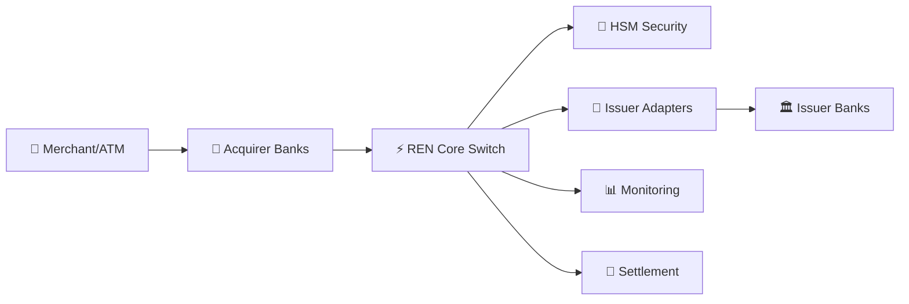

# 🏦 CASHNET Payment Processing System Documentation

[](./CASHNET_Complete_Documentation.md)
[]()
[]()

## 📋 Overview

This repository contains comprehensive documentation for **CASHNET**, a mission-critical real-time payment processing system that handles millions of financial transactions daily. CASHNET serves as the central nervous system connecting merchants, acquirer banks, and issuer banks in a secure, reliable, and highly available ecosystem.

## 🎯 Key Features

- **⚡ Real-time Processing**: 95% of transactions in <1 second (p95), 99% in <1.5 seconds (p99)
- **🔒 Security-First**: PCI DSS compliant with Hardware Security Module (HSM) protection
- **🏗️ High Availability**: Active-active configuration with <1 hour RTO, near-zero RPO
- **📊 Full Observability**: Complete monitoring with Graylog, Grafana, and custom dashboards
- **🔄 Scalable**: Designed to handle 2× peak transaction loads

## 📚 Documentation

### 🚀 Quick Start
- **[Complete System Documentation](./CASHNET_Complete_Documentation.md)** - The main comprehensive guide

### 📖 Source Materials
- **[Beginner Guide](./new.txt)** - End-to-end guide to payment processing
- **[System Diagrams](./new.md)** - Mermaid diagrams and visual flows
- **[Architecture Handbook](./CASHNET_Architecture_Handbook.pdf)** - Technical specifications
- **[Study Guide](./CASHNET_Beginner_to_Pro_Study_Guide.pdf)** - Learning materials

## 🏗️ System Architecture



## 🔧 Core Components

| Component | Purpose | Technology |
|-----------|---------|------------|
| **REN Core** | Central transaction router | High-performance switch |
| **HSM** | Cryptographic operations | Hardware security module |
| **Issuer Adapters** | Bank protocol translation | Multi-protocol support |
| **Observability** | System monitoring | Graylog, Grafana |
| **Settlement** | End-of-day processing | Batch reconciliation |

## 📊 Performance Metrics

- **Transaction Volume**: Millions of transactions daily
- **Response Time**: p95 < 1s, p99 < 1.5s
- **Availability**: 99.99% uptime SLA
- **Capacity**: 2× peak load handling
- **Security**: PCI DSS Level 1 compliant

## 🛡️ Security Features

- **🔐 HSM Protection**: Hardware-based cryptographic operations
- **🔒 Data Encryption**: TLS 1.3 in transit, PGP at rest
- **👤 Access Control**: Role-based access with dual control
- **📝 Audit Trails**: Complete transaction logging
- **🛡️ Compliance**: PCI DSS, ISO 27001 standards

## 🚨 Operational Excellence

### Daily Operations
- ✅ Start-of-shift health checks
- 📊 Real-time monitoring dashboards
- 🔄 End-of-day settlement processing
- 📋 Incident response procedures

### Error Handling
- **VAL-001**: Validation errors
- **CRY-001**: Cryptographic failures
- **ISS-001**: Issuer timeouts
- **RTG-001**: Routing issues

## 📈 Monitoring & Alerting

### Key Dashboards
- **Transaction Volume**: Real-time TPS monitoring
- **Response Times**: Latency distribution (p50, p95, p99)
- **Error Rates**: Success/failure ratios
- **System Health**: CPU, memory, queue depths

### Alert Thresholds
- Response time > 1s (p95)
- Error rate > 0.1%
- Queue depth > 1000
- HSM utilization > 60%

## 🔄 High Availability

- **Active-Active**: Multiple REN nodes
- **Geographic Distribution**: Multi-datacenter deployment
- **Automatic Failover**: Sub-second detection
- **Disaster Recovery**: 1-hour RTO, near-zero RPO
- **Quarterly DR Drills**: Tested recovery procedures

## 📋 Compliance & Standards

- **PCI DSS**: Payment Card Industry compliance
- **ISO 8583**: Financial messaging standard
- **EMV**: Chip card processing
- **FIPS 140-2**: Cryptographic module standards

## 🤝 Contributing

This documentation is maintained by the CASHNET Architecture Team. For updates or corrections:

1. Review the [Complete Documentation](./CASHNET_Complete_Documentation.md)
2. Submit issues for any discrepancies
3. Follow change control procedures for updates

## 📞 Support & Contacts

- **Operations Team**: 24/7 NOC support
- **Architecture Team**: Business hours + emergency
- **Security Team**: Incident response
- **Compliance Team**: Regulatory matters

## 📄 License

This documentation is proprietary and confidential. Distribution is restricted to authorized personnel only.

---

## 🎨 Visual Documentation

This repository includes comprehensive visual documentation with:
- **12 Mermaid Diagrams**: System flows and architecture
- **Component Relationships**: Detailed interaction maps
- **Process Workflows**: Step-by-step procedures
- **Error Handling**: Troubleshooting guides

All diagrams are rendered automatically by GitHub's Mermaid support for beautiful, interactive documentation.

---

## 🚀 GitHub Pages Setup

This repository is configured for GitHub Pages with Mermaid diagram support:

1. **Enable GitHub Pages**: Go to repository Settings → Pages → Source: Deploy from a branch → Branch: main/master
2. **Mermaid Support**: Diagrams will render automatically with the custom Jekyll configuration
3. **Test Page**: Visit [test-mermaid.md](./test-mermaid.md) to verify diagram rendering
4. **Main Documentation**: Access the full documentation at your GitHub Pages URL

### 🔧 Local Development

To run locally with proper Mermaid rendering:

```bash
# Install dependencies
bundle install

# Serve locally
bundle exec jekyll serve

# View at http://localhost:4000
```

### 📱 Mobile Responsive

All diagrams and documentation are optimized for mobile viewing with responsive design.

---

**📚 [Start Reading the Complete Documentation →](./index.md)**

**🧪 [Test Mermaid Rendering →](./test-mermaid.md)**
