# CASHNET: Complete System Documentation & Architecture Guide

## Table of Contents

1. [Executive Summary](#executive-summary)
2. [System Overview](#system-overview)
3. [Architecture Components](#architecture-components)
4. [Transaction Flow Diagrams](#transaction-flow-diagrams)
5. [Security Framework](#security-framework)
6. [Operations & Monitoring](#operations--monitoring)
7. [End-of-Day Processing](#end-of-day-processing)
8. [High Availability & Disaster Recovery](#high-availability--disaster-recovery)
9. [Error Handling & Troubleshooting](#error-handling--troubleshooting)
10. [Operational Procedures](#operational-procedures)
11. [Technical Specifications](#technical-specifications)
12. [Compliance & Standards](#compliance--standards)
13. [Glossary](#glossary)
14. [Appendices](#appendices)

---

## Executive Summary

**CASHNET** is a mission-critical, real-time payment processing system that serves as the central nervous system for financial transactions. Operating 24/7 with sub-second response times, CASHNET processes millions of payment transactions daily, connecting merchants, acquirer banks, and issuer banks in a secure, reliable, and highly available ecosystem.

### Key System Characteristics:
- **Real-time Processing**: 95% of transactions completed in <1 second (p95), 99% in <1.5 seconds (p99)
- **High Volume**: Designed to handle 2× peak transaction loads
- **Security-First**: PCI DSS compliant with Hardware Security Module (HSM) protection
- **High Availability**: Active-active configuration with <1 hour RTO, near-zero RPO
- **Comprehensive Monitoring**: Full observability with Graylog, Grafana, and custom dashboards

---

## System Overview

### What is CASHNET?

CASHNET is a sophisticated payment processing platform that acts as the central hub for financial transactions. Think of it as the "air traffic control system" for payments - it receives transaction requests from merchants and ATMs, routes them to the appropriate banks for authorization, and ensures secure, fast processing while maintaining complete audit trails and financial reconciliation.

### Core Mission

CASHNET's primary mission is to:
1. **Process** payment transactions in real-time with maximum reliability
2. **Route** transactions to the correct issuer banks based on card BIN ranges
3. **Secure** all sensitive data using industry-leading cryptographic standards
4. **Monitor** system health and performance continuously
5. **Reconcile** all financial data for accurate settlement and reporting

---

## Architecture Components

### High-Level System Architecture


### Component Details

#### 1️⃣ Merchant / ATM / E-commerce
**Purpose**: Transaction origination points where customers initiate payments
- **Merchants**: Point-of-sale terminals in retail locations
- **ATMs**: Automated teller machines for cash withdrawals and deposits
- **E-commerce**: Online payment gateways and digital platforms

#### 2️⃣ Acquirer Banks
**Purpose**: First entry point into the banking network for merchant transactions
- **HSBC Acquirer/Issuer**: Dual-role bank handling both merchant acquisition and card issuance
- **CITI Acquirer/Issuer**: Another major financial institution with dual capabilities
- **Function**: Receive transaction requests from merchants and forward to CASHNET

#### 3️⃣ Renaissance Online (REN) - The Core Switch
**Purpose**: Central transaction processing engine and router
- **Primary Function**: Acts as the "brain" of CASHNET
- **Key Capabilities**:
  - Message normalization and validation
  - BIN-based routing to appropriate issuers
  - Transaction logging and metrics collection
  - Real-time decision processing
  - Load balancing and failover management

#### 4️⃣ Hardware Security Module (HSM)
**Purpose**: Cryptographic fortress for all security operations
- **PIN Translation**: Secure PIN format conversion (ISO-0/1/3)
- **EMV Processing**: ARQC validation and ARPC generation
- **Key Management**: Secure storage and handling of cryptographic keys
- **MAC Generation**: Message authentication codes for data integrity
- **Compliance**: FIPS 140-2 Level 3 certified hardware

#### 5️⃣ Issuer Adapters
**Purpose**: Protocol translators for bank-specific communication
- **Barclays Adapter**: Handles Barclays-specific message formats and protocols
- **Deutsche Adapter**: Manages Deutsche Bank communication requirements
- **HSBC Adapter**: Processes HSBC issuer-specific transactions
- **CITI Adapter**: Handles Citibank issuer communications
- **Other Issuers**: Adapters for additional banking partners

#### 6️⃣ Issuer Banks
**Purpose**: Final decision makers for transaction authorization
- **Account Validation**: Check customer account status and balance
- **Risk Assessment**: Evaluate transaction for fraud indicators
- **Authorization Decision**: Approve or decline based on multiple factors
- **Response Generation**: Send authorization codes and response messages

#### 7️⃣ Downstream Systems

##### WS Feed (WebSocket Feed)
- **Real-time Data Stream**: Continuous flow of transaction facts
- **Near Real-time**: Sub-second latency for critical updates
- **Consumer Integration**: Feeds downstream reconciliation systems

##### SFTP Folder
- **Secure File Transfer**: Machine-readable files for batch processing
- **File Types**: Settlement reports, transaction summaries, reconciliation data
- **Security**: PGP encryption, checksums, atomic file operations

##### DMS (Document Management System)
- **Human-readable Reports**: PDF, CSV, HTML formats
- **Accessibility**: Web-based access for operations and finance teams
- **Report Types**: Daily summaries, exception reports, audit trails

##### Offline RT/Clearing
- **Reconciliation Engine**: Matches transactions across all systems
- **Exception Handling**: Identifies and resolves discrepancies
- **General Ledger Integration**: Posts to financial accounting systems
- **Dispute Management**: Handles chargeback and dispute processes

#### 8️⃣ Observability & Operations

##### Graylog
- **Centralized Logging**: Structured JSON logs from all components
- **Search & Analysis**: Full-text search across all log data
- **Alerting**: Real-time alerts based on log patterns
- **Retention**: Configurable log retention policies

##### Grafana
- **Metrics Visualization**: Real-time dashboards and charts
- **Performance Monitoring**: TPS, latency, error rates
- **Alerting**: Threshold-based alerts and notifications
- **Historical Analysis**: Trend analysis and capacity planning

##### REN UI Console
- **Operational Control**: Safe, audited system interactions
- **Role-Based Access**: RBAC with principle of least privilege
- **System Status**: Real-time health and status monitoring
- **Configuration Management**: Controlled changes to system settings

---

## Transaction Flow Diagrams

### Real-Time Authorization Flow

```mermaid
sequenceDiagram
    %% Module 3: Real-time Authorization Flow
    autonumber

    participant C as 1️⃣ Cardholder<br/>(Customer paying)
    participant M as 2️⃣ Merchant / ATM / E-com<br/>(Point of Sale)
    participant ACQ as 3️⃣ Acquirer Bank<br/>(HSBC / CITI)
    participant REN as 4️⃣ REN Core<br/>(Switch/Router)
    participant HSM as 5️⃣ HSM<br/>(Crypto Safe)
    participant ADP as 6️⃣ Issuer Adapter<br/>(Translator)
    participant ISS as 7️⃣ Issuer Bank<br/>(Decision Maker)
    participant WS as 8️⃣ WS Feed<br/>(Real-time data stream)
    participant LOG as 9️⃣ Logs & Metrics<br/>(Graylog/Grafana)

    C->>M: Step 1: Tap / Swipe card<br/>(Start transaction)
    M->>ACQ: Step 2: Send transaction request<br/>(PAN, Amount, PIN/EMV)
    ACQ->>REN: Step 3: Forward Auth Request<br/>(ISO-8583/JSON over TLS)

    REN->>HSM: Step 4: Crypto checks<br/>(PIN translate, ARQC, MAC)
    HSM-->>REN: Step 4a: Return OK / Fail

    REN->>ADP: Step 5: Route to Issuer Adapter<br/>(based on BIN rules)
    ADP->>ISS: Step 6: Send Issuer-specific message
    ISS-->>ADP: Step 7: Approve / Decline + Auth Code
    ADP-->>REN: Step 8: Return response
    REN-->>ACQ: Step 9: Send decision
    ACQ-->>M: Step 10: Show Approved / Declined

    REN->>WS: Step 11: Push txn facts downstream
    REN->>LOG: Step 12: Log + Metrics<br/>(Graylog / Grafana dashboards)
```



### ISO-8583 Message Processing

```mermaid
flowchart TB
  %% Module 4: ISO-8583 core fields, validation, mapping, masking

  subgraph ACQ["1️⃣ Incoming Auth Message (from Acquirer)"]
    MSG["ISO-8583 / JSON over TLS"]
  end

  subgraph FIELDS["2️⃣ Important Fields (subset)"]
    F2["F2 PAN\n(card number)\nLog: mask 6+4"]
    F3["F3 Processing Code\n(purchase/refund)"]
    F4["F4 Amount (minor units)"]
    F7["F7 Trans DateTime (MMDDhhmmss)"]
    F11["F11 STAN (local trace)"]
    F37["F37 RRN (global trace)"]
    F41["F41 Terminal ID"]
    F42["F42 Merchant ID"]
    F49["F49 Currency"]
    F52["F52 PIN Data (encrypted)"]
    F55["F55 EMV Data (ARQC TLVs)"]
    F64["F64/128 MAC (message auth)"]
  end

  subgraph NORM["3️⃣ Normalizer (REN)"]
    VAL["Validation\n(required fields / formats)"]
    MAP["Field Mapping\n(variant → REN model)"]
    MASK["Masking/Redaction\n(PAN 6+4; no CVV/PIN)"]
  end

  subgraph MODEL["4️⃣ REN Internal Model"]
    RQ["ren_txn_request\n{ pan_masked, amount_minor,\nstan, rrn, merchant, terminal,\nemv, currency, ... }"]
  end

  subgraph OBS["5️⃣ Observability"]
    LOG["Graylog JSON Log\n{txn_id, stage, pan_masked,\nstan, rrn, amount_minor, ...}"]
    MET["Grafana Metrics\n(tps, p95, p99, errors)"]
  end

  %% Flow
  MSG --> FIELDS
  FIELDS --> VAL --> MAP --> MASK --> RQ
  RQ --> LOG
  RQ --> MET

  %% Notes (as separate nodes; dotted links)
  N1["📝 EMV F55 TLVs:\n• ARQC (card cryptogram)\n• TVR/TSI (risk indicators)"]
  F55 -.-> N1

  N2["🛡️ Never log CVV,\nfull PAN, clear PIN, or keys.\nMask PAN as 6+4 only."]
  MASK -.-> N2
```



---

## Security Framework

### HSM and Cryptographic Key Management


### Security Layers


### Security Measures Detail

#### Data Protection
- **Encryption in Transit**: All communications use Mutual TLS (mTLS) with FIPS-approved cipher suites
- **Encryption at Rest**: Files stored with PGP encryption and full disk encryption
- **Data Masking**: PAN masked to show only first 6 and last 4 digits in logs
- **Sensitive Data Handling**: CVV, clear PIN, and cryptographic keys are NEVER logged or stored

#### Access Control
- **Role-Based Access Control (RBAC)**: Granular permissions based on job functions
- **Dual Control**: Critical operations require two authorized personnel
- **Audit Ceremonies**: All key management operations are documented and audited
- **Certificate Management**: Regular rotation of TLS certificates and cryptographic keys

#### Compliance
- **PCI DSS**: Full compliance with Payment Card Industry Data Security Standard
- **Network Segmentation**: Isolated security zones for different trust levels
- **Regular Audits**: Quarterly security assessments and penetration testing
- **Incident Response**: Documented procedures for security incident handling

---

## Operations & Monitoring

### Observability Architecture


### Key Performance Indicators (KPIs)

#### Transaction Metrics
- **Transactions Per Second (TPS)**: Current and peak transaction rates
- **Response Time**: p95 < 1 second, p99 < 1.5 seconds
- **Success Rate**: Target >99.9% successful authorizations
- **Error Rate**: Monitor and alert on error spikes

#### System Health Metrics
- **HSM Utilization**: Keep below 60% at peak load
- **Queue Depth**: Monitor for backlog indicators
- **CPU/Memory Usage**: System resource utilization
- **Network Latency**: End-to-end communication delays

#### Business Metrics
- **Authorization Volume**: Daily/hourly transaction counts
- **Decline Rate**: Monitor for unusual decline patterns
- **Settlement Accuracy**: Reconciliation match rates
- **SLA Compliance**: Availability and performance targets

---

## End-of-Day Processing

### EOD Clearing & Settlement Flow

```mermaid
flowchart TB
  %% Module 7: EOD Clearing & Settlement

  subgraph ITM["7.1 ITM / Scheduler"]
    CUT["Cutover Window\n(e.g. 23:30–23:59)"]
  end

  subgraph REN["7.2 REN Core"]
    AGG["Aggregate Txns\n(by acquirer / issuer / merchant)"]
    BUILD1["Build ESHTRNOP File\n(HSBC/CITI)"]
    BUILD2["Build Settlement Reports\n(Other Banks)"]
    BUILD3["Build REN FD File\n(Finance / GL)"]
  end

  subgraph SFTPBox["7.3 SFTP Folder"]
    SFTP["Machine-readable files\n.csv + .sha256 + .asc"]
  end

  subgraph DMSBox["7.4 DMS"]
    DMS["Human-readable Reports\n(PDF/CSV/HTML)"]
  end

  subgraph WSBox["7.5 WS Feed"]
    WS["Real-time Txn Facts"]
  end

  subgraph OFF["7.6 Offline RT / Clearing"]
    RECO["Reconciliation & GL Posting\n(Exception handling, disputes)"]
  end

  %% Flows
  CUT --> AGG
  AGG --> BUILD1 --> SFTP
  AGG --> BUILD2 --> SFTP
  AGG --> BUILD3 --> SFTP
  BUILD3 --> DMS

  WS --> RECO
  SFTP --> RECO
  DMS --> RECO
```



### EOD Process Details

#### 1. Cutover Window (23:30-23:59)
- **Pre-cutover Checks**: Ensure all in-flight transactions are completed
- **Queue Drainage**: Wait for all processing queues to empty
- **System Preparation**: Ready all components for batch processing

#### 2. Data Aggregation
- **Transaction Grouping**: Organize by acquirer, issuer, and merchant
- **Volume Calculations**: Sum amounts and transaction counts
- **Exception Identification**: Flag any discrepancies or errors

#### 3. File Generation
- **ESHTRNOP Files**: Specific format for HSBC and CITI banks
- **Settlement Reports**: Standard format for other issuer banks
- **REN FD Files**: Finance and General Ledger integration files

#### 4. File Distribution
- **Atomic Operations**: Files written as .part then renamed to final name
- **Integrity Checks**: SHA256 checksums generated for all files
- **Encryption**: PGP encryption applied where required
- **Acknowledgments**: Wait for ACK files from recipients

#### 5. Reconciliation
- **Multi-source Validation**: Compare WS Feed, SFTP files, and DMS reports
- **Exception Handling**: Investigate and resolve any mismatches
- **GL Posting**: Update financial systems with daily totals

---

## High Availability & Disaster Recovery

### HA/DR Architecture

```mermaid
flowchart TB
  %% Module 8: High Availability & DR

  subgraph DC1["8.1 Primary Data Center"]
    R1["REN-A (Active)"]
    R2["REN-B (Active)"]
    H1["HSM-1"]
    H2["HSM-2"]
    A1["Issuer Adapters (Scaled)"]
    S1["SFTP Cluster"]
    O1["Obs: Graylog/Grafana"]
  end

  subgraph DC2["8.2 DR Data Center"]
    RDR["REN-DR (Standby / Active)"]
    HDR["HSM-DR"]
    ADR["Issuer Adapters DR"]
    S2["SFTP DR"]
    O2["Obs DR"]
  end

  %% Connections in primary
  R1 <--> R2
  R1 --> H1
  R2 --> H2
  R1 --> A1
  R2 --> A1
  R1 --> S1
  R2 --> S1
  R1 --> O1
  R2 --> O1

  %% Replication / DR
  R1 --> RDR
  R2 --> RDR
  H1 --> HDR
  H2 --> HDR
  S1 --> S2
  O1 --> O2

  %% Notes
  N1["📝 High Availability:\n- REN nodes in Active/Active\n- HSM in pairs\n- Adapters scaled"]
  N2["📝 Disaster Recovery:\n- Target RTO ~1h\n- RPO ~0 for Auth\n- Quarterly DR drills"]
  N3["📝 Capacity Planning:\n- Design for 2× peak TPS\n- Keep HSM util <60%\n- Monitor CPU/queues"]

  DC1 --- N1
  DC2 --- N2
  S1 --- N3
```



### HA/DR Specifications

#### High Availability Design
- **Active-Active Configuration**: Multiple REN nodes processing simultaneously
- **Load Balancing**: Intelligent distribution of transaction load
- **Automatic Failover**: Sub-second detection and recovery
- **Data Replication**: Real-time synchronization between nodes
- **Health Monitoring**: Continuous component health checks

#### Disaster Recovery Objectives
- **Recovery Time Objective (RTO)**: ~1 hour for full system restoration
- **Recovery Point Objective (RPO)**: Near-zero data loss for authorizations
- **Geographic Separation**: DR site located in different region
- **Regular Testing**: Quarterly DR drills and failover exercises
- **Documentation**: Detailed runbooks for all recovery scenarios

#### Capacity Planning
- **Peak Load Handling**: System designed for 2× peak transaction volume
- **Resource Monitoring**: Continuous tracking of CPU, memory, and network
- **HSM Utilization**: Maintain <60% utilization at peak load
- **Queue Management**: Monitor and alert on queue depth thresholds
- **Scalability**: Horizontal scaling capabilities for growth

---

## Error Handling & Troubleshooting

### Error Code Catalog

```mermaid
flowchart TD
  %% Module 11: Error Codes & Actions

  Start["⚠️ 11.0 Error Detected"]

  Start --> VAL["11.1 VAL-001\nValidation Error"]
  Start --> CRY1["11.2 CRY-001\nCrypto Error (ARQC/PIN/MAC)"]
  Start --> CRY2["11.3 CRY-002\nHSM Unavailable"]
  Start --> RTG["11.4 RTG-001\nRouting / BIN Error"]
  Start --> ISS["11.5 ISS-001\nIssuer Timeout"]
  Start --> FIL1["11.6 FIL-001\nFile Transfer Error"]
  Start --> FIL2["11.7 FIL-002\nDuplicate File"]
  Start --> SCH["11.8 SCH-001\nScheduler Job Error"]
  Start --> SEC["11.9 SEC-001\nCertificate Expired"]

  %% Actions
  VAL --> A1["Action: Check input fields,\nengage Acquirer"]
  CRY1 --> A2["Action: Check EMV params,\nalign with Issuer"]
  CRY2 --> A3["Action: Failover to backup HSM,\nraise incident"]
  RTG --> A4["Action: Update BIN table\nwith Change Control"]
  ISS --> A5["Action: Pause route in REN UI,\ncontact Issuer NOC"]
  FIL1 --> A6["Action: Retry transfer,\ncheck permissions"]
  FIL2 --> A7["Action: Use new run-id\n(ensure idempotency)"]
  SCH --> A8["Action: Check dependencies,\nrerun ITM job"]
  SEC --> A9["Action: Rotate certificates\n(update trust stores)"]
```



### Common Error Scenarios

#### VAL-001: Validation Error
- **Cause**: Missing or invalid ISO-8583 fields
- **Symptoms**: Transaction rejected at REN entry point
- **Resolution**: 
  1. Check message format against ISO-8583 specification
  2. Validate required fields are present and properly formatted
  3. Contact acquirer to correct message format
  4. Update validation rules if legitimate format variation

#### CRY-001: Crypto Error
- **Cause**: ARQC/PIN/MAC validation failure
- **Symptoms**: HSM returns cryptographic validation error
- **Resolution**:
  1. Verify EMV parameters match issuer configuration
  2. Check PIN format and encryption keys
  3. Validate MAC calculation parameters
  4. Coordinate with issuer to align cryptographic settings

#### CRY-002: HSM Unavailable
- **Cause**: Hardware Security Module failure or communication loss
- **Symptoms**: All crypto operations failing
- **Resolution**:
  1. Immediate failover to backup HSM
  2. Raise critical incident alert
  3. Investigate primary HSM status
  4. Coordinate hardware replacement if needed

#### ISS-001: Issuer Timeout
- **Cause**: Issuer bank not responding within timeout threshold
- **Symptoms**: Increased response times, timeout errors
- **Resolution**:
  1. Pause or throttle traffic to affected issuer
  2. Contact issuer NOC for status update
  3. Monitor for recovery
  4. Gradually restore traffic when stable

---

## Operational Procedures

### Daily Operations Runbook


### Incident Response Playbook

#### Issuer Down Scenario


### Operational Best Practices

#### DO's and DON'Ts

```mermaid
flowchart TB
  %% Module 10: Do's & Don'ts

  subgraph DO["10.1 ✅ DO's"]
    D1["Do-1: Mask PAN (6+4 only),\nHash txn_id, redact secrets"]
    D2["Do-2: Use atomic file writes\n(.part → final) + unique run-ids"]
    D3["Do-3: Set proactive alerts\n(p95 latency, issuer timeout,\nSFTP lag)"]
    D4["Do-4: Maintain test BINs\n+ golden transactions for UAT"]
  end

  subgraph DONT["10.2 ❌ DON'Ts"]
    N1["Don't-1: Change routing/keys\nwithout ticket + peer review + rollback"]
    N2["Don't-2: Retry blindly on\ncrypto errors (investigate cause)"]
    N3["Don't-3: Re-emit batch file\nwith same run-id (causes duplicates)"]
    N4["Don't-4: Store CVV or clear PIN\nanywhere (logs, DB, backups)"]
  end

  %% Simple flows for clarity
  DO --> DONT
```



---

## Technical Specifications

### Data Model Relationships


### Message Formats

#### ISO-8583 Key Fields
- **F2 - PAN**: Primary Account Number (masked in logs as 6+4 digits)
- **F3 - Processing Code**: Transaction type (purchase, refund, etc.)
- **F4 - Amount**: Transaction amount in minor currency units
- **F7 - Transmission Date/Time**: MMDDhhmmss format
- **F11 - STAN**: System Trace Audit Number (local trace)
- **F37 - RRN**: Retrieval Reference Number (global trace)
- **F41 - Terminal ID**: Point-of-sale terminal identifier
- **F42 - Merchant ID**: Merchant identification
- **F49 - Currency**: ISO 4217 currency code
- **F52 - PIN Data**: Encrypted PIN block
- **F55 - EMV Data**: Chip card cryptographic data (TLV format)
- **F64/128 - MAC**: Message Authentication Code

#### EMV TLV Tags (Field 55)
- **ARQC**: Application Request Cryptogram
- **TVR**: Terminal Verification Results
- **TSI**: Transaction Status Information
- **AID**: Application Identifier
- **ATC**: Application Transaction Counter

### Performance Specifications

#### Response Time Targets
- **p95 Latency**: <1 second for 95% of transactions
- **p99 Latency**: <1.5 seconds for 99% of transactions
- **Maximum Latency**: <5 seconds for any transaction
- **Timeout Thresholds**: Configurable per issuer (typically 30-60 seconds)

#### Throughput Capacity
- **Peak TPS**: System designed for 2× peak historical load
- **Sustained TPS**: 24/7 operation at high transaction volumes
- **Burst Handling**: Temporary spikes up to 3× normal load
- **HSM Utilization**: <60% at peak load for optimal performance

---

## Compliance & Standards

### PCI DSS Compliance

#### Scope and Requirements
- **Cardholder Data Environment (CDE)**: Segmented network zones
- **Data Protection**: Encryption of cardholder data at rest and in transit
- **Access Control**: Strong authentication and authorization mechanisms
- **Network Security**: Firewalls and network segmentation
- **Vulnerability Management**: Regular security testing and updates
- **Monitoring**: Comprehensive logging and monitoring systems

#### Key Controls
1. **Build and Maintain Secure Networks**
   - Firewall configuration and management
   - Default password changes
   - Network segmentation

2. **Protect Cardholder Data**
   - Data encryption standards
   - PAN masking in logs (6+4 format)
   - Secure key management

3. **Maintain Vulnerability Management**
   - Regular security updates
   - Antivirus software deployment
   - Secure system development

4. **Implement Strong Access Control**
   - Role-based access control (RBAC)
   - Multi-factor authentication
   - Physical access restrictions

5. **Regularly Monitor and Test Networks**
   - Security monitoring systems
   - Regular penetration testing
   - File integrity monitoring

6. **Maintain Information Security Policy**
   - Documented security policies
   - Security awareness training
   - Incident response procedures

### Industry Standards

#### ISO 8583
- **Message Format**: Standard for financial transaction messaging
- **Field Definitions**: Standardized data elements
- **Message Types**: Authorization, financial, administrative
- **Bitmap Structure**: Efficient field presence indication

#### EMV Standards
- **Chip Card Technology**: Secure payment processing
- **Cryptographic Standards**: ARQC/ARPC validation
- **Terminal Requirements**: EMV-compliant POS devices
- **Certification Process**: EMV testing and approval

#### FIPS 140-2
- **Cryptographic Module Standards**: HSM certification requirements
- **Security Levels**: Level 3 certification for HSMs
- **Key Management**: Secure cryptographic key handling
- **Physical Security**: Tamper-evident hardware requirements

---

## Glossary

### A-C
- **ACQ**: Acquirer - Financial institution that processes merchant transactions
- **ARQC**: Application Request Cryptogram - EMV chip card authentication data
- **ARPC**: Application Response Cryptogram - Issuer response to ARQC
- **BDK**: Base Derivation Key - Master key for generating unique transaction keys
- **BIN**: Bank Identification Number - First 6-8 digits of card number for routing
- **CASHNET**: The payment processing system described in this document
- **CVV**: Card Verification Value - 3-4 digit security code (never stored)

### D-H
- **DMS**: Document Management System - Human-readable report repository
- **DUKPT**: Derived Unique Key Per Transaction - Dynamic key generation method
- **EMV**: Europay, Mastercard, Visa - Global chip card payment standard
- **EOD**: End of Day - Daily batch processing and settlement period
- **FIPS**: Federal Information Processing Standards - US cryptographic standards
- **HSM**: Hardware Security Module - Dedicated cryptographic processing device

### I-P
- **ISS**: Issuer - Bank that issued the payment card to cardholder
- **ITM**: Integrated Task Manager - Scheduler for batch processing jobs
- **LMK**: Local Master Key - Primary encryption key protecting all other keys
- **MAC**: Message Authentication Code - Data integrity verification
- **mTLS**: Mutual Transport Layer Security - Bidirectional encrypted communication
- **PAN**: Primary Account Number - Full credit/debit card number
- **PCI DSS**: Payment Card Industry Data Security Standard

### Q-Z
- **RBAC**: Role-Based Access Control - Permission system based on job functions
- **REN**: Renaissance Online - Core transaction processing engine
- **RPO**: Recovery Point Objective - Maximum acceptable data loss in disaster
- **RRN**: Retrieval Reference Number - Unique transaction identifier
- **RTO**: Recovery Time Objective - Maximum acceptable downtime in disaster
- **SFTP**: Secure File Transfer Protocol - Encrypted file transmission method
- **STAN**: System Trace Audit Number - Local transaction sequence number
- **TLS**: Transport Layer Security - Encryption protocol for data in transit
- **TPS**: Transactions Per Second - System throughput measurement
- **ZMK**: Zone Master Key - Key exchange mechanism with partner institutions
- **ZPK**: Zone PIN Key - Encryption key specifically for PIN data protection

---

## Appendices

### Appendix A: Network Diagrams

#### Network Topology
```
[Internet] 
    |
[DMZ Firewall]
    |
[Load Balancer]
    |
[Application Tier]
    |-- REN Core Cluster
    |-- Issuer Adapters
    |-- HSM Cluster
    |
[Data Tier]
    |-- Database Cluster
    |-- SFTP Servers
    |-- Log Aggregation
    |
[Management Network]
    |-- Monitoring Systems
    |-- Backup Systems
    |-- DR Replication
```

### Appendix B: Configuration Templates

#### REN Configuration Example
```yaml
ren:
  core:
    max_concurrent_transactions: 10000
    timeout_seconds: 30
    retry_attempts: 3
  
  routing:
    bin_ranges:
      - bin_start: "400000"
        bin_end: "499999"
        issuer: "visa_issuer"
      - bin_start: "500000"
        bin_end: "599999"
        issuer: "mastercard_issuer"
  
  security:
    hsm_endpoint: "hsm.internal:9000"
    tls_version: "1.3"
    cipher_suites: ["TLS_AES_256_GCM_SHA384"]
```

### Appendix C: Monitoring Dashboards

#### Key Grafana Dashboard Panels
1. **Transaction Volume**: Real-time TPS with historical trends
2. **Response Time Distribution**: p50, p95, p99 latency percentiles
3. **Error Rate**: Success/failure ratios by error type
4. **System Health**: CPU, memory, disk utilization
5. **HSM Status**: Cryptographic operation success rates
6. **Queue Depth**: Message queue backlogs and processing rates

### Appendix D: Emergency Contacts

#### Escalation Matrix
- **Level 1**: Operations Team (24/7 NOC)
- **Level 2**: System Engineers (On-call rotation)
- **Level 3**: Architecture Team (Business hours + emergency)
- **Level 4**: Vendor Support (HSM, Network, Database)

#### External Contacts
- **Issuer Banks**: NOC contact information for each partner
- **Acquirer Banks**: Technical support contacts
- **Regulatory Bodies**: Compliance and reporting contacts
- **Audit Firms**: External audit and assessment teams

### Appendix E: Change Management

#### Change Control Process
1. **Change Request**: Formal documentation of proposed changes
2. **Impact Assessment**: Technical and business impact analysis
3. **Approval Workflow**: Multi-level approval based on change risk
4. **Testing Requirements**: Mandatory testing in non-production environments
5. **Rollback Planning**: Documented procedures for change reversal
6. **Post-Implementation Review**: Validation of change success

#### Emergency Change Procedures
- **Critical Security Issues**: Expedited approval process
- **System Outages**: Emergency change authority delegation
- **Regulatory Requirements**: Compliance-driven change procedures
- **Vendor Patches**: Streamlined update processes for critical fixes

---

## Document Control

- **Document Version**: 1.0
- **Last Updated**: [Current Date]
- **Next Review Date**: [Quarterly Review]
- **Document Owner**: CASHNET Architecture Team
- **Approval**: [System Architect, Security Officer, Operations Manager]
- **Distribution**: All CASHNET stakeholders and operations personnel

---

*This document contains comprehensive information about the CASHNET payment processing system. It should be treated as confidential and distributed only to authorized personnel with a legitimate business need to know.*
