# CASHNET High-Level Flow

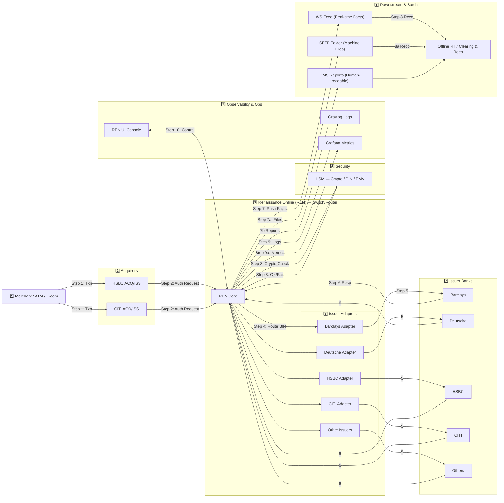
### How to Read

1.  **1 → 2**: Merchant sends txn → Acquirer forwards to REN
    
2.  **3**: REN Core calls HSM for crypto check
    
3.  **4–6**: REN routes to correct Issuer Adapter → Issuer Bank → decision back
    
4.  **7–8**: REN pushes facts & files downstream (WS, SFTP, DMS → Offline/Clearing)
    
5.  **9**: Logs to Graylog, metrics to Grafana
    
6.  **10**: Ops use REN UI to monitor/control

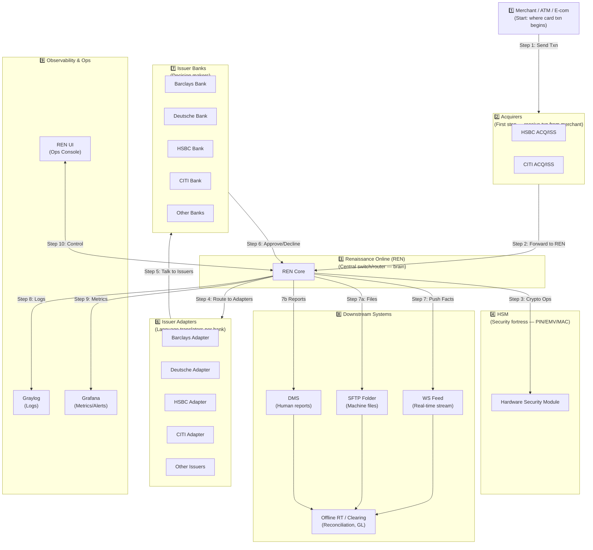

-   **1️⃣ Merchant/ATM/E-com** → Origin of transactions.
    
-   **2️⃣ Acquirers (HSBC, CITI)** → First entry into banking world.
    
-   **3️⃣ REN Core** → The “traffic cop” / brain.
    
-   **4️⃣ HSM** → Safe for PIN/EMV/crypto.
    
-   **6️⃣ Issuer Adapters** → Translate REN language → Issuer protocols.
    
-   **7️⃣ Issuer Banks** → Approve/Decline.
    
-   **8️⃣ Downstream** → Files, feeds, and reconciliation.
    
-   **9️⃣ Observability & Ops** → Eyes & controls: Graylog, Grafana, REN UI.
    
-   **10** → Ops interact safely with REN.

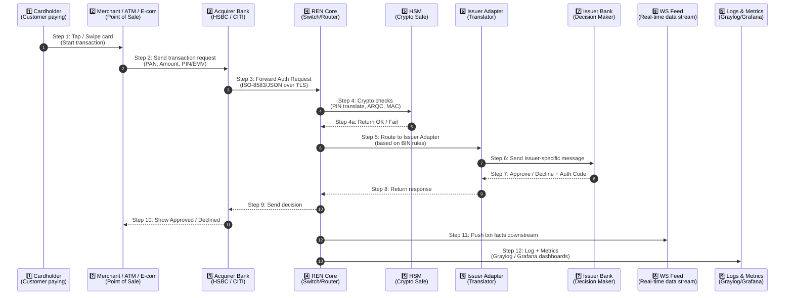

-   **Step 1–3**: Cardholder → Merchant/ATM → Acquirer → REN.
    
-   **Step 4**: REN asks **HSM** to validate PIN/EMV cryptograms & MAC.
    
-   **Step 5–7**: REN routes to correct **Issuer Adapter** → Issuer Bank decides approve/decline.
    
-   **Step 8–10**: Response flows back → REN → Acquirer → Merchant → Cardholder.
    
-   **Step 11**: REN pushes transaction facts to **WS Feed** for back-office.
    
-   **Step 12**: Logs & metrics sent to Graylog/Grafana; Ops monitor via REN
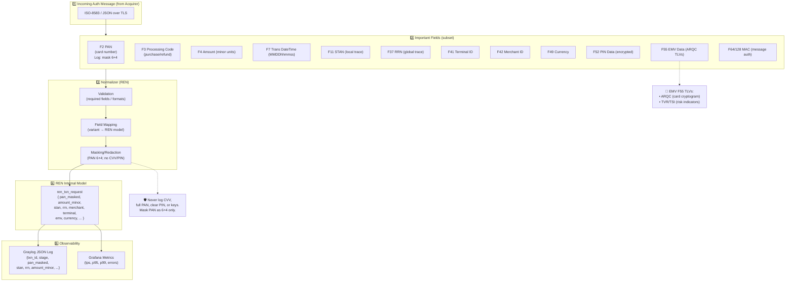

-   **1 → 2**: Auth message arrives with key ISO fields.
    
-   **3**: REN validates, maps issuer variant → internal model, and **masks** sensitive data.
    
-   **4**: Clean internal `ren_txn_request` is produced.
    
-   **5**: Safe, structured log + metrics emitted (no secrets).
    

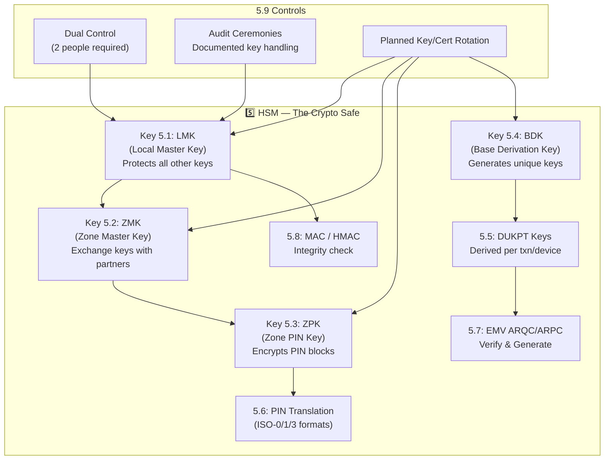

-   **LMK (Local Master Key)** → the “master lock” inside HSM, protects everything.
    
-   **ZMK (Zone Master Key)** → used to exchange keys with partner banks securely.
    
-   **ZPK (Zone PIN Key)** → used for encrypting customer PIN blocks.
    
-   **BDK (Base Derivation Key)** → generates one-time keys (DUKPT).
    
-   **DUKPT Keys** → unique per transaction/device.
    
-   **PIN Translation, EMV cryptograms, MAC/HMAC** → done only inside the HSM.
    
-   **Controls** → dual control, ceremonies, rotations to ensure compliance & safety.

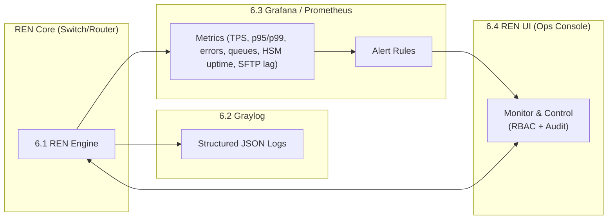

-   **Step 1** → Logs go into **Graylog** for deep transaction tracing.
    
-   **Step 2** → Metrics (TPS, latency, errors, HSM uptime) go to **Grafana/Prometheus**.
    
-   **Step 3** → **Alert rules** trigger warnings to Ops before customers feel impact.
    
-   **Step 4** → Ops use **REN UI** (RBAC-controlled) for safe operational actions.

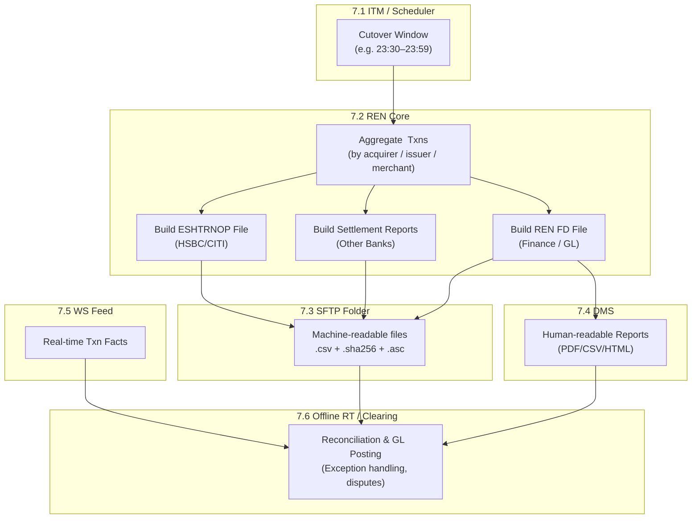

-   **7.1 ITM (Scheduler)** → opens the **cutover window** at end of day.
    
-   **7.2 REN Core** → aggregates all daily transactions and builds 3 types of files:
    
    -   **ESHTRNOP** → for HSBC & CITI
        
    -   **Settlement Reports** → for other issuers
        
    -   **REN FD file** → finance/general ledger
        
-   **7.3 SFTP Folder** → stores machine-readable files with **.part → rename → checksum → ACK** process.
    
-   **7.4 DMS** → publishes human-readable reports for finance/ops.
    
-   **7.5 WS Feed** → streams near-real-time data.
    
-   **7.6 Offline RT/Clearing** → consumes WS + SFTP + DMS to perform reconciliation, exception handling, and GL posting.

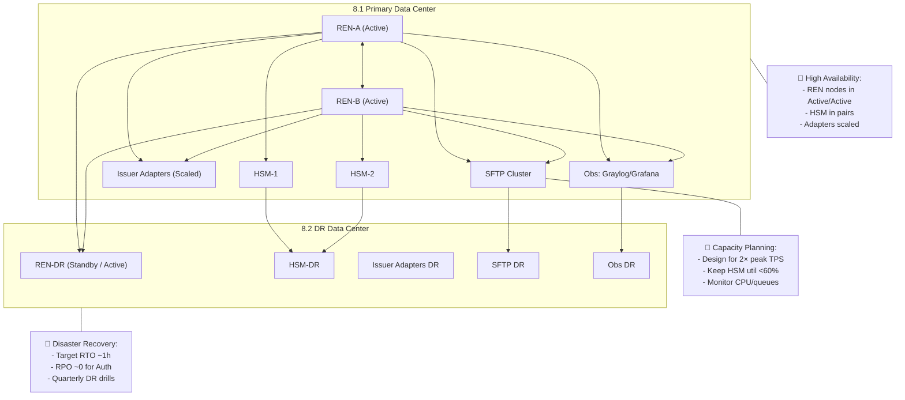

-   **8.1 Primary DC** → multiple REN nodes run **Active/Active**; HSM in **pairs**; Adapters scale horizontally.
    
-   **8.2 DR DC** → standby systems replicate configs, routing tables, keys, and logs.
    
-   **Replication** → REN, HSM backups, SFTP, and observability dashboards sync to DR.
    
-   **Capacity** → system designed to handle **2× peak load** with **HSM <60% utilization** at peak.
```mermaid
flowchart TD
  %% Module 9: Runbooks & Checklists

  subgraph Daily["9.1 Start-of-Shift Checks"]
    D1["Step 1: Check TPS/Latency in Grafana"]
    D2["Step 2: Verify Queue Depth < threshold"]
    D3["Step 3: Issuer Adapters status = GREEN"]
    D4["Step 4: HSM HA status & key versions"]
    D5["Step 5: ITM calendar (holidays, cutover)"]
    D6["Step 6: SFTP space >20% & last ACK received"]
    D7["Step 7: DMS reports published"]
    D8["Step 8: WS Feed consumer lag <60s"]
  end

  subgraph EOD["9.2 End-of-Day Monitoring"]
    E1["Pre-cutover: ensure inflight ≈ 0, queues drained"]
    E2["Check ITM job chain start/finish times"]
    E3["Verify ESHTRNOP / Settlement / REN FD files built"]
    E4["Check .part → final rename, .sha256, PGP"]
    E5["Confirm ACK files from downstream"]
    E6["Validate DMS reports accessible"]
    E7["Reco totals match acquirer/issuer summaries"]
  end

  subgraph Incident["9.3 Quick-Play (Issuer Down)"]
    I1["Step A: Confirm issue (Grafana p95/p99, Graylog ISS-001)"]
    I2["Step B: Contain — Pause/Throttle route in REN UI"]
    I3["Step C: Coordinate with Issuer NOC (open ticket)"]
    I4["Step D: Recover — Warm-up traffic after green"]
    I5["Step E: Post-Incident — Document & RCA"]
  end

  %% Flow arrows (linear in each subgraph)
  D1 --> D2 --> D3 --> D4 --> D5 --> D6 --> D7 --> D8
  E1 --> E2 --> E3 --> E4 --> E5 --> E6 --> E7
  I1 --> I2 --> I3 --> I4 --> I5

```
-   **Daily checks (9.1)** → Operators start shift by checking Grafana (TPS/latency), queues, adapter health, HSM, ITM jobs, SFTP space/ACKs, DMS reports, and WS lag.
    
-   **EOD monitoring (9.2)** → During cutover, ensure no inflight txns, verify all files built, renamed, checksummed, ACK’d, and reconciliation balances.
    
-   **Incident quick-play (9.3)** → 5 steps: Confirm → Contain → Coordinate → Recover → Post-incident learning.

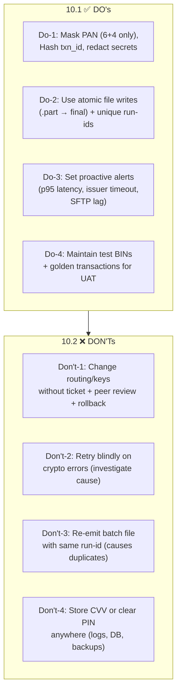
-   **DO’s (10.1)**
    
    1.  Always **mask sensitive data** (PAN 6+4).
        
    2.  Use **atomic file handling** and unique run IDs.
        
    3.  Configure **alerts early** (catch problems before customers do).
        
    4.  Keep **test BINs & golden transactions** ready for validation.
        
-   **DON’T’s (10.2)**
    
    1.  Never make routing/crypto key changes without **formal process**.
        
    2.  Don’t **blindly retry crypto errors** (they mean setup mismatch).
        
    3.  Don’t resend files with the **same run ID**.
        
    4.  Never **store CVV or clear PIN** anywhere. 	
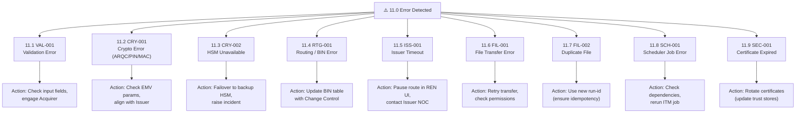

-   **11.1 VAL-001** → Missing/invalid ISO field → fix request, contact Acquirer.
    
-   **11.2 CRY-001** → Crypto mismatch (bad EMV/PIN) → check params with Issuer.
    
-   **11.3 CRY-002** → HSM down → failover, escalate incident.
    
-   **11.4 RTG-001** → BIN routing gap → fix routing in change window.
    
-   **11.5 ISS-001** → Issuer not responding → pause route, inform NOC, retry later.
    
-   **11.6 FIL-001** → File transfer issue → retry, check SFTP permissions.
    
-   **11.7 FIL-002** → Duplicate file run-id → regenerate with new run-id.
    
-   **11.8 SCH-001** → Scheduler job failed → check predecessor, rerun.
    
-   **11.9 SEC-001** → Certificate expired → emergency rotate, update trust stores.

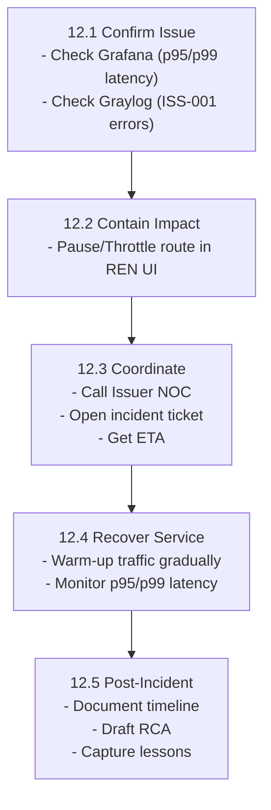

-   **12.1 Confirm** → Use Grafana & Graylog to verify the spike in timeouts/errors.
    
-   **12.2 Contain** → Pause or throttle traffic in **REN UI** to limit customer impact.
    
-   **12.3 Coordinate** → Call the **Issuer’s NOC**, open ticket, get estimated fix time.
    
-   **12.4 Recover** → Slowly ramp up traffic once Issuer is stable, keep monitoring latency.
    
-   **12.5 Post-Incident** → Document everything, write RCA, capture learnings

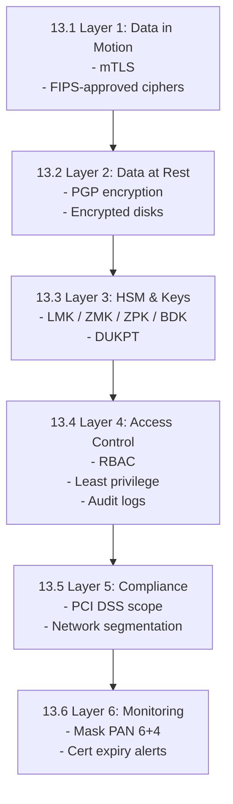

-   **13.1 Data in Motion** → All comms encrypted with **mTLS** + strong ciphers.
    
-   **13.2 Data at Rest** → Files stored with **PGP encryption** and encrypted disks.
    
-   **13.3 HSM & Keys** → Keys (LMK, ZMK, ZPK, BDK, DUKPT) live only inside HSM.
    
-   **13.4 Access Control** → Strict **RBAC**, dual control, audit logs.
    
-   **13.5 Compliance** → PCI DSS rules, segmentation, retention.
    
-   **13.6 Monitoring** → Mask sensitive data, alert on certificate expiry & key drift.

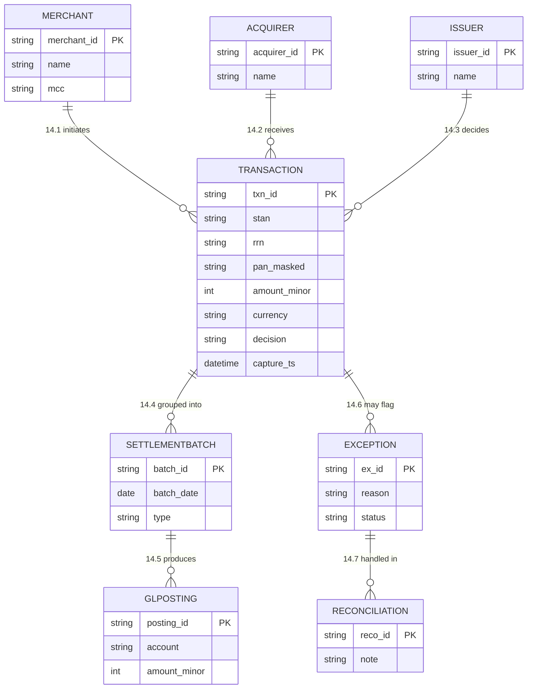

-   **14.1 Merchant** → initiates transactions.
    
-   **14.2 Acquirer** → receives them.
    
-   **14.3 Issuer** → decides (approve/decline).
    
-   **14.4 Transactions** are grouped into **Settlement Batches**.
    
-   **14.5 Batches** generate **GL Postings** for Finance.
    
-   **14.6 Exceptions** are linked to failed/mismatched transactions.
    
-   **14.7 Reconciliation** handles exceptions and ensures totals match.