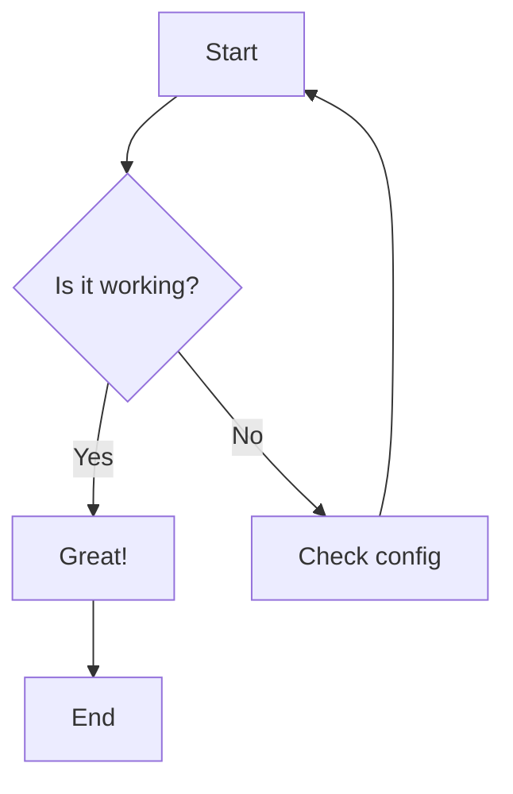
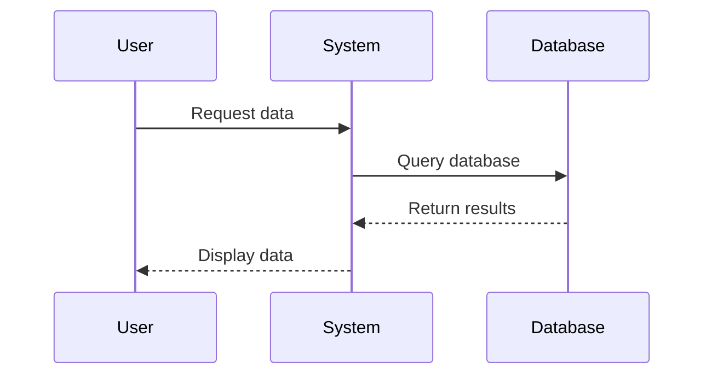
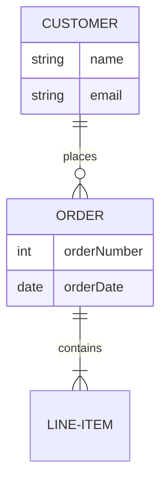

# Mermaid Test Page

This page tests if Mermaid diagrams render correctly on GitHub Pages.

## Simple Flowchart Test

## Sequence Diagram Test

## ER Diagram Test

If you can see the diagrams above rendered as interactive graphics (not just code blocks), then Mermaid is working correctly!
